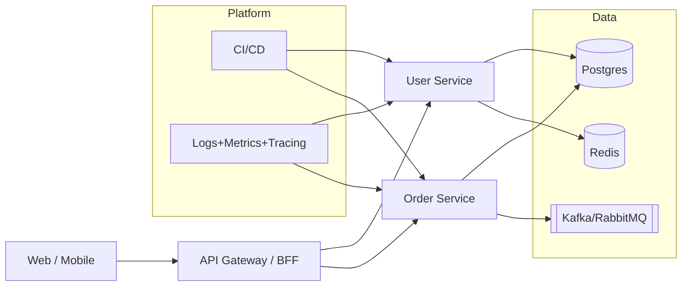

<h1 align="center">Mobin Rezaeifar</h1>

<b>Tech Lead & Software Architect</b> · Web Platforms · Cloud · DX

  
  
  
  

  

## Snapshot
- Tech Lead focused on **clarity, delivery, and DX**. I design systems, align stakeholders, and keep feedback loops short.
- Strengths: **architecture & trade-offs**, **team enablement**, **platform thinking**, **secure-by-default**.
- Toolbox (hands-on when needed): React/Next.js, TypeScript, .NET/Node.js, containers, CI/CD, observability.

## Selected Impact
- Led a squad of <N> engineers to ship <Product/Platform>, cutting lead time by **<XX>%** and reducing incidents by **<YY>%**.
- Re-architected <system/service> (event-driven + caching) to handle **<X>×** traffic with **<Y>%** cost reduction.
- Built an internal **DX platform** (templates, pipelines, docs) that bootstraps new services in **<Z> minutes**.
- Mentored <N> engineers; **<N promotions / N cross-team moves>**.

## Operating Principles
- **Clarity first** (ADR, concise RFCs) · **Small batches** (trunk-based + CI) · **Observability before scale** · **Security by default**

## Architecture (sample)

## Playbooks & Templates
- **Engineering Playbook** — ways of working, branching, release & on-call → [`/engineering-playbook`](https://github.com/mobinrezaeifar/engineering-playbook)
- **Service Template** — Next.js/.NET starter with CI, lint/test, container, CD → [`/service-template`](https://github.com/mobinrezaeifar/service-template)
- **ADR/RFC Template** — lightweight decisions with context → [`/adr-template`](https://github.com/mobinrezaeifar/adr-template)

## Talks & Writing
- <Talk title> — <Conf/Meetup, 2025> · slides/demo → `<link>`
- <Post title> — dev.to → `<link>`
- <Podcast/Panel> — `<link>`

## Tech Focus
TypeScript · React/Next.js · .NET/Node.js · Redis/RabbitMQ/Kafka · PostgreSQL  
Docker/K8s · Nginx · GitHub Actions · Observability (logs/metrics/traces)

## Contact
- LinkedIn: https://www.linkedin.com/in/mbnrz  
- dev.to: https://dev.to/mobinrezaeifar  
- Stack Overflow: https://stackoverflow.com/users/21860347  

PS: lines of code and language charts don’t reflect leadership impact. See “Selected Impact” above.

  
Optional GitHub stats (collapsed)

  

    
    
  

  

    
  

