<h1 align="center">Mobin Rezaeifar</h1>

<b>Tech Lead & Software Architect</b> · I build teams & systems that ship

<b>Currently no public repos due to active involvement in company projects.</b>

  
  
  
  

  

## About me
I’m a Tech Lead who enjoys turning ambiguity into outcomes. I align product, engineering, and stakeholders; make trade-offs explicit; and keep feedback loops short so teams can ship confidently.

- **Strengths:** architecture & decision-making, enabling engineers, platform/operating models, secure-by-default thinking.  
- **What I value:** clarity > cleverness, small batches, observability, and psychological safety.

## Outcomes I’m proud of
- Cut lead time from commit→prod by **38%**, while keeping change-failure rate under **9%** with safer rollouts.  
- Scaled a customer-facing domain to **4×** traffic with **28%** lower infrastructure cost by simplifying the architecture.  
- Reduced incident MTTR from **3h → 25min** through on-call runbooks, better alerts, and blameless reviews.  
- Coached **8** engineers; **3 promotions** and **2 cross-team moves** through structured mentoring.

## How I lead
- **Clarity first:** write concise RFCs/ADRs and define “Definition of Done” up front.  
- **Small bets:** ship thin slices, measure impact, iterate fast.  
- **Autonomy with alignment:** goals and guardrails are explicit; teams choose the “how”.  
- **Operational excellence:** observability, SLOs, and incident learning—before scale.

## Operating loop

```mermaid
flowchart TD
  A["💡 Idea / Problem"] --> B["📊 Business Understanding & Alignment"]
  B --> C["📝 RFC & Trade-offs"]
  C --> D["🧩 Thin Slice Planning"]
  D --> E["👥 Build & Pairing"]
  E --> F["✅ CI · Tests · Preview"]
  F --> G["🚀 Release & Rollout"]
  G --> H["📈 Observe<br/>Metrics · Logs · Traces"]
  H --> I["🔍 Learn<br/>Post-incident · Insights"]
  I --> A
  classDef primary fill:#0d1117,stroke:#1f6feb,stroke-width:1px,color:#c9d1d9,rx:6,ry:6
  class A,B,C,D,E,F,G,H,I primary
```

## Working with me
- **Context up front:** I share goals, constraints, and known risks early so everyone understands the “why”.  
- **Transparent decisions:** I record trade-offs with short ADRs; reversibility guides the speed of change.  
- **Calm delivery:** I favor small, reversible releases with clear rollback paths and visible health checks.  
- **Simple cadence:** weekly demos, async updates, focused 1:1s—few standing meetings, lots of signal.  
- **Growth & ownership:** thoughtful reviews, pairing on hard changes, and celebrating team wins.

## Tech I’m comfortable with
- **Architecture & Design:** Domain-Driven Design (DDD) · Event-Driven Architecture (EDA) · Microservices · Micro-Frontends · Clean Architecture · CQRS · Hexagonal / Onion Architecture  
- **Backend Platforms:** .NET · Node.js · TypeScript · Event-driven systems (Kafka/RabbitMQ)  
- **Frontend (when needed):** React · Next.js · Micro-Frontend orchestration  
- **Datastores:** PostgreSQL · Redis  
- **DevOps & Infrastructure:** Docker · Docker Swarm · Kubernetes · Helm · GitHub Actions · ArgoCD · Infrastructure as Code (Terraform)  
- **Observability & Reliability:** Prometheus · Grafana · OpenTelemetry · SLO/SLA management · Chaos Engineering  
- **Security & Compliance:** Secure-by-default design · OWASP best practices · Identity & Access Management · Secrets management (Vault/KMS) · Threat modeling · Zero Trust principles

## Contact
- LinkedIn: https://www.linkedin.com/in/mbnrz  
- dev.to: https://dev.to/mobinrezaeifar  
- Stack Overflow: https://stackoverflow.com/users/21860347  
- Email: mbnrz.dev@gmail.com

  
Optional GitHub stats (collapsed)

  

    
    
  

  

    
  

